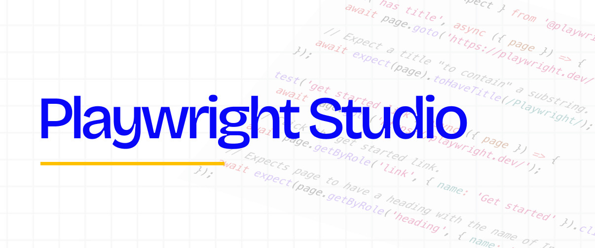

# Playwright Studio

<p align="center">
  
</p>

A desktop launcher that starts a **fully isolated** Playwright Chromium to record a scenario and generate its code. The app **controls the environment** (isolation, proxy, packaging, distribution); the capture engine and selector generation are **not** rewritten — Playwright (`codegen`) does the recording.

## Why

Launched "by hand", `playwright codegen` inherits your Chrome profile, cookies, authenticated sessions and system proxy. Recorded scenarios end up polluted by an already-logged-in session and uncontrolled network routing.

Playwright Studio's answer:

- **A clean Chromium on every launch**: a **non-persistent** context with a temporary profile that is discarded on close.
- **No inherited state**: never a fixed `user-data-dir`, `storageState`, `--save-storage` / `--load-storage`, or `--incognito`.
- **Controlled proxy**: `direct` mode by default (a genuinely direct connection, including `localhost`), with the option to inherit the system proxy or configure one manually — the choice is always explicit.

## Usage

Distribution: a **portable Windows x64 `.exe`** (no installation, no Node/Playwright required on the machine).

1. **Double-click** the portable exe. The configuration window opens.
2. Fill in the form:
   - **Start URL** (optional): the page to begin recording on.
   - **Target language**: `playwright-test`, `javascript`, `python`, `python-pytest`, `java` or `csharp`.
   - **Output file**: name + folder ("Browse…" button). The chosen path is shown under the field.
   - **Proxy** (3 modes, **`direct` by default**):
     - `direct` — no proxy, direct connection (recommended);
     - `system` — inherit the Windows proxy (a warning is shown: network isolation is no longer guaranteed);
     - `manual` — server (`http://proxy:8080`) + optional bypass list.
   - **Advanced** (collapsible): viewport (width × height) **or** a Playwright device (`iPhone 15`…, mutually exclusive), engine, and HTTP headers (API engine only).
3. Click **"Start recording"**. A **separate Chromium** opens with the Playwright inspector/recorder.
4. **Interact** in the browser: code is generated as you go.
5. **Stop** ("Stop" button or by closing the browser): the app returns to the "Done" state, the **code is written to the output file**, and a **copyable preview** is shown ("Copy" button).

### The two engines

| Engine | Role | Code output |
|--------|------|-------------|
| **`codegen`** (recommended, default) | Standard `playwright codegen` recorder | **Automatic file** via `--output`, written live during recording |
| **`api`** (`page.pause`) | Fallback for advanced contexts (custom HTTP headers) | **No automatic file output**: retrieve the code via the inspector's **"copy" button** (documented limitation — see [DECISIONS.md](docs/DECISIONS.md) Q3) |

## Isolation guarantees

Verifiable facts (see [ARCHITECTURE.md](docs/ARCHITECTURE.md) §4 and [VALIDATION-WINDOWS.md](docs/VALIDATION-WINDOWS.md) batches 1–3):

- **Temporary profile discarded**: Chromium runs in a temporary `--user-data-dir` (`%TEMP%\playwright_chromiumdev_profile-XXXX`) created at launch and deleted on close.
- **Never** a fixed `user-data-dir`, `storageState`, `--save-storage` / `--load-storage`, or `--incognito` (hard bans).
- **`direct` mode is genuinely direct**, including `localhost`: implemented via `--proxy-server=direct:// --proxy-bypass=*` + env `PLAYWRIGHT_DISABLE_FORCED_CHROMIUM_PROXIED_LOOPBACK=1` (`direct://` alone gets rewritten and breaks navigation — see [DECISIONS.md](docs/DECISIONS.md) Q1).
- **`system` mode = explicit, assumed inheritance**: no proxy flag is emitted, Chromium picks up the Windows proxy. The UI flags this with a warning.
- **No shared session** between two successive recordings.

## Development

Requirements: **Node 22.x** (aligned with the Node bundled in Electron 38).

```bash
# Install dependencies.
# Under restricted egress (Electron CDN / Playwright browsers blocked), disable
# downloads at install time:
#   ELECTRON_SKIP_BINARY_DOWNLOAD=1   → no Electron binary (dev without packaging)
#   PLAYWRIGHT_SKIP_BROWSER_DOWNLOAD=1 → no browsers at install
npm install

# Run the app in development mode (electron-vite).
npm run dev

# Unit + smoke tests (vitest).
# The smoke test launches a real headed Chromium → on Linux, wrap it in xvfb:
xvfb-run -a npm test        # Linux
npm test                    # Windows / macOS

# Type checking (main).
npm run typecheck
```

Actual npm scripts: `dev`, `build`, `typecheck`, `test`, `prepare-browsers`, `dist:win`.

Building the portable `.exe` is described in [docs/BUILD.md](docs/BUILD.md).

## Pinned versions

Do not track `latest`. The stack is pinned and tested exactly as-is.

| Component | Pinned version | Detail |
|-----------|----------------|--------|
| Playwright | **1.56.1** | Drives recording and codegen |
| Chromium (recorded) | revision **1194** = **141.0.7390.37** | Browser driven by Playwright, bundled via `resources/ms-playwright` |
| Electron | **38.8.6** | Bundles **Node 22.x**; also serves as the Node runtime to spawn the CLI (`ELECTRON_RUN_AS_NODE`) |
| Node (build) | **22.x** | Aligned with Electron 38 |

> Electron's Chromium (the app UI, 140.x) and Playwright's Chromium (rev 1194, 141.x, recorded) are two distinct processes with no interaction.

**Rule**: any version bump = **full re-test of batch 0** (packaging, out-of-asar inspector, proxy, isolation). Rationale in [DECISIONS.md](docs/DECISIONS.md) Q5.

## Documentation

- [docs/ARCHITECTURE.md](docs/ARCHITECTURE.md) — reference contract, stack, IPC, isolation, packaging.
- [docs/DECISIONS.md](docs/DECISIONS.md) — technical trade-offs with evidence (Q1 direct proxy, Q2 asar/inspector, Q3 A2 output, Q4 `@playwright/cli`, Q5 version matrix).
- [docs/BUILD.md](docs/BUILD.md) — reproducible build (Nexus, GitHub Actions CI, signing, troubleshooting).
- [docs/VALIDATION-WINDOWS.md](docs/VALIDATION-WINDOWS.md) — validation checklist on a clean Windows machine.

## License

[MIT](LICENSE)
